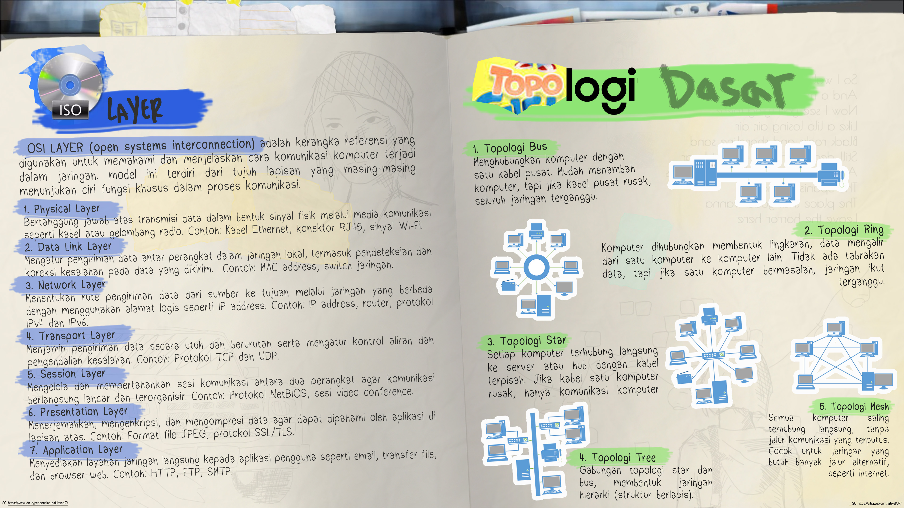

# LATIHAN-LAB-1
Jum'at 8 Agustus 2025

Mengoreksi soal dari tahap 1 dan mempelajari TCP/IP, Topologi Dasar, dan OSI Layer yang dijadikan file presentasi.

# TCP/IP, ISO Layer, Topologi Dasar
  
# RFC (Request for Comments
	RFC Adalah salah satu dokumen informasi standar internet ber seri, biasanya digunakan dalamjaringan, internet dan beberapa OS jaringan, mulai dari Unix, Windows, dan Novell NetWare. Diterbitkan oleh ISOC (Internet Society) dan badan-badan penyusun standar, seperti Internet Enginering Task Force (IETF) atau Internet Research Task Force (IRTF). 
Beberapa RFC yang bisa digunakan:
1. RFC 791 = Internet Protocol
2. RFC 1035 = DNS
3. RFC 1918 = Address Allocation for Private Internet
4. Dan masi banyak lagi

# IP Address
IP Address Adalah Alamat perangkat jaringan.  
IP Private, IP yang digunakan hanya di local.  
Range,  
*10.0.0.0 – 10.255.255.255 /8 (10/8 prefix)  
172.16.0.0 – 172.31.255.255 /12 (172.16/12 prefix)  
192.168.0.0 – 192.168.255.255 /16 (192.168/16 prefix)*  
IP Public, IP yang digunakan untuk terhubung ke internet.  
*Range,  
sisa dari IP Private.*  

# Subnetting
	Subnetting adalah teknik dalam jaringan komputer yang digunakan untuk membagi sebuah jaringan besar menjadi beberapa jaringan kecil yang disebut subnet. Teknik ini membantu dalam pengelolaan alamat IP secara efisien, meningkatkan keamanan, dan mengurangi lalu lintas jaringan.  
   
**Mengapa subnetting penting**
1. Membagi jaringan besar memungkinkan penggunaan alamat IP yang lebih efektif, menghindari pemborosan.
2. Memisahkan jaringan menjadi subnet membantu mengurangi lalu lintas broadcast, meningkatkan kinerja jaringan.
3. Membagi jaringan ke dalam subnet membuat pengelolaan perangkat dan koneksi lebih terstruktur.

**Konsep Dasar Subnetting**  
	Subnetting dilakukan dengan cara meminjam bit dari bagian host dalam alamat IP dan menggunakannya sebagai network bits. Hal ini menciptakan lebih banyak jaringan dengan jumlah host yang lebih kecil.  

Struktur Alamat IP:

    Network Bits: Bagian dari alamat IP yang mengidentifikasi jaringan.
    Host Bits: Bagian dari alamat IP yang mengidentifikasi perangkat dalam jaringan.

Subnet Mask:  

    Subnet mask digunakan untuk menentukan batas antara network bits dan host bits.
    Contoh: Subnet mask 255.255.255.0 berarti 24 bit pertama adalah network bits (ditulis sebagai /24).  

# TCP UDP
  
**TCP**  
	TCP adalah singkatan dari kata Transmission Control Protocol. Dari kata tersebut kita sudah bisa langsung tahu bahwa TCP merupakan sebuah protokol. Protokol ini bekerja dengan membaca data dengan cepat sehingga bisa melakukan transfer dengan cepat.  
   
**Cara kerja TCP/IP akan dijelaskan dibawah ini.**

    - Pertama, data dipecah menajadi data–data kecil yang sesuai ukuran bandwith atau lebar 		frekuensi data yang dikirim. Nantinya, data yang dipecah disatukan dan disusun untuk sampai tujuan.
    - Lapisan TCP akan dirangkum sesuai informasi header lalu ditransmisikan ke lapisan IP
    - IP menerima data TCP dan menambah header data sendirinya, kemudian meneruskan data hingga sampai ke tujuan.  

**UDP**  
	UDP atau yang disebut dengan User Datagram Protocol. UDP merupakan protokol yang sangat diperlukan jika sangat membutuhkan kecepatan dalam konektivitas. Protokol ini merupakan kebalikan dari TCP. Dimana pesan diprotokol ditransfer dengan tidak mempertimbangkan hubungan konektivitas antara host. UDP bekerja tidak berurut, sehingga file tidak dapat diidentifikasi atau diprediksi kapan akan sampai pertama kali.  

# OSI LAYER

